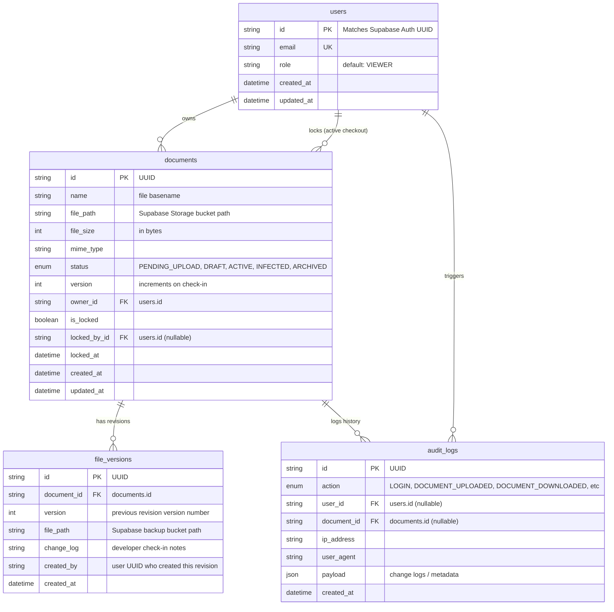

# Project Memory Bank: brain.md
## System Name: MITCON Credential Digital File Storage System (BCD-FSS)
**Document Version:** 1.0.0  
**Last Updated:** June 29, 2026  

This document serves as the persistent memory, architectural blueprint, and technical documentation bank for all engineers working on the **MITCON Credential Digital File Storage System (BCD-FSS)**.

---

## 1. High-Level Design (HLD) & Technology Stack

The project implements a **Stateless Three-Tier Architecture** optimized for high concurrency, real-time lock synchronization, and asynchronous job boundaries.

```
       [ Client Presentation Tier ] (React 19, Zustand, TanStack Query)
                   │
                   ▼ (HTTPS / WSS via Nginx Proxy)
        [ API Business Logic Tier ] (Express 5, Node.js ES2023 ESM)
         ├── Auth & Identity Sync (Supabase Auth API)
         └── Real-time WS Sync (Socket.IO with Redis Adapter)
                   │
                   ├── Asynchronous Enqueue
                   │   ▼
                   │ [ BullMQ Background Jobs ] (Malware Scan, PDF Gen)
                   │   │
                   ▼   ▼
        [ Relational Database & Cache Tier ]
         ├── Database: PostgreSQL (Prisma ORM Client Singleton)
         ├── Cache / Queue Broker: Redis Server Cluster
         └── Blob Object Store: Supabase Storage Buckets
```

### Technical Blueprint:
* **Frontend:** React 19, Vite, Tailwind CSS, Zustand, TanStack Query, ShadCN UI.
* **Backend:** Node.js (ES2023 JS ESM), Express 5.
* **Database & ORM:** PostgreSQL + Prisma ORM Client.
* **Authentication:** Supabase Auth Integration (signed JWTs, OIDC).
* **Binary Storage:** Supabase Storage (S3-compatible bucket keys).
* **Caching & Queue:** Redis Server + BullMQ.
* **WebSockets:** Socket.IO utilizing `@socket.io/redis-adapter` for auto-scale environments.
* **Security Middleware:** Helmet headers, CORS filters, express-rate-limit, jsonwebtoken, bcrypt.

---

## 2. Entity-Relationship (ER) Database Schema

The database relies on PostgreSQL mapped via the Prisma ORM Client. The models optimize relational indexes and cascade deletions.



---

## 3. Low-Level Design (LLD) & Modular Boundaries

The backend implements a **Feature-Based Modular Architecture** to keep boundary scopes strict and testable as the codebase scales.

### 3.1. Standard Module Structure
Every business feature (e.g. `src/modules/documents/`) must adhere to this folder structure:
* **`*.routes.js`:** Declares endpoints and wires middlewares (auth, validators) to controllers.
* **`*.controller.js`:** Transport boundary (HTTP req/res). Extracts variables, invokes DTOs, and calls Services.
* **`*.dto.js`:** Serializes incoming request parameters (Input DTO) and formats outgoing records (Output DTO).
* **`*.service.js`:** Agnostic business algorithm orchestrations. No Express variables.
* **`*.repository.js`:** Pure database query handlers using the Prisma Client singleton.
* **`*.validation.js`:** Zod verification schemas checking request shapes.

### 3.2. Middleware Execution Chain
```
[Client Call]
    │
    ├── 1. Security filters (Helmet, CORS)
    ├── 2. Rate Limiting check
    ├── 3. Correlation Token generation (requestIdMiddleware)
    ├── 4. Request Logging (pino-http)
    ├── 5. Supabase JWT Authentication checks (auth.mw.js)
    ├── 6. RBAC Role scopes & MFA checks (rbac.mw.js)
    ├── 7. Request shape validations (Zod validateRequest)
    │
    ▼
[Controller Handler] ─── (Invokes DTO & Service)
    │
    ├── Route processing throws Domain Exception...
    │
    ▼
[Error Logger (errorLogger.mw)] ─── Logs correlated error metrics via Request ID
    │
    ▼
[Global Express Error Formatter] ─── Returns standardized JSON error envelope
```

---

## 4. Architectural Decision Records (ADRs)

### ADR-001: Decoupling HTTP Transport and Server Bootstrap
* **Context:** Integration tests need to assert HTTP routes without blocking physical ports.
* **Decision:** We separate the Express pipeline configuration (`app.js`) from the network port listener (`server.js`).
* **Consequences:** Supertest runs mock HTTP assertions in-memory, avoiding port collision errors.

### ADR-002: Fail-Fast Zod Verification Configs
* **Context:** Undefined environment variables (e.g., missing API keys) can lead to silent errors during runtime.
* **Decision:** Create `config/env.js` which loads variables using `dotenv` and parses them using Zod validation.
* **Consequences:** If any key is missing or type-mismatched, the server logs validation errors and crashes immediately during boot.

### ADR-003: Singleton Pattern for Database and Cache Clients
* **Context:** Opening new connection channels for every query exhausts PostgreSQL and Redis connection pool limits.
* **Decision:** Export database, Redis, and Supabase client instances as singletons from the `config/` layer.
* **Consequences:** The application maintains a constant, optimized pool size across its lifecycle.

### ADR-004: Structured JSON Logging using Pino
* **Context:** Default `console.log()` outputs are slow and unparseable by log indexers.
* **Decision:** Use Pino and pino-http for logging. Toggle `pino-pretty` formatting in development and raw JSON in production.
* **Consequences:** Fast, non-blocking logs that are easily indexed by log aggregators (e.g. Datadog).

### ADR-005: Pure JavaScript (ES2023) ESM with JSDoc
* **Context:** The team decided to avoid compilation overheads and build using native JavaScript ESM.
* **Decision:** Write all files as standard `.js` ES Modules. Document arguments and return values using JSDoc.
* **Consequences:** Eliminates compilation steps (`tsc`), enables native Node.js hot-reloads (`node --watch`), and maintains IDE autocomplete.

---

## 5. Architectural Workflows

### 5.1. Authentication & Profile Sync Flow
Supabase Auth manages client credentials, generating a JWT.
1. Client submits JWT in the `Authorization: Bearer <JWT>` header.
2. Express backend decodes and verifies the token signature against the `SUPABASE_JWT_SECRET`.
3. If valid, the backend checks if the user's UUID exists in the local PostgreSQL `users` table.
4. If missing (first login), the backend synchronously duplicates the profile into the local database (setting the default role to `VIEWER`).
5. Evaluates Multi-Factor Authentication (MFA) status by inspecting the JWT `amr` claims array (checking for `mfa`).
6. Attaches the user object and MFA state to the request object (`req.user`).

### 5.2. Document Direct-to-Storage Upload Flow
Avoids routing large file uploads through the Express process:
1. Client calls `POST /api/v1/documents/upload-intent` specifying metadata.
2. Backend creates a database record with `status: PENDING_UPLOAD` and returns a Supabase Storage signed upload URL.
3. Client uploads the binary file directly to the S3 bucket using the signed URL.
4. Client calls `POST /api/v1/documents/:id/complete-upload` notifying the backend that the upload finished.
5. Backend updates the database status to `DRAFT` and enqueues a background BullMQ job for malware scanning.

### 5.3. Concurrency Checkout & Return Flow
Guarantees file locking and prevents edit conflicts:
1. User A requests checkout via `POST /api/v1/documents/:id/checkout`.
2. Backend starts a database transaction to verify lock status. If unlocked, sets `isLocked: true`, `lockedById: UserA`, and `lockedAt: new Date()`.
3. Broadcasts a `DOCUMENT_LOCKED` WebSocket event via Socket.IO to disable edit controls for other users.
4. When finished, User A uploads the modified file and calls `POST /api/v1/documents/:id/checkin`.
5. Backend verifies User A owns the active lock, commits a new `FileVersion` record, increments `version`, clears the lock fields, and broadcasts a `DOCUMENT_UNLOCKED` event.

---

## 6. Implementation Registry & Created Files

The following files have been created in the `backend/` project workspace:

### 6.1. Configuration Layer (`src/config/`)
* **[env.js](file:///c:/Users/Vibin.Cariappa/Desktop/Credentia/backend/src/config/env.js):** Environment variable verification and schema parsing.
* **[database.js](file:///c:/Users/Vibin.Cariappa/Desktop/Credentia/backend/src/config/database.js):** Exports the Prisma database connection client singleton.
* **[supabase.js](file:///c:/Users/Vibin.Cariappa/Desktop/Credentia/backend/src/config/supabase.js):** Initializes and exports the Supabase client wrapper.
* **[redis.js](file:///c:/Users/Vibin.Cariappa/Desktop/Credentia/backend/src/config/redis.js):** Sets up and exports the Redis Client singleton.
* **[bullmq.js](file:///c:/Users/Vibin.Cariappa/Desktop/Credentia/backend/src/config/bullmq.js):** Defines BullMQ queue names, default retries, and job backoff limits.
* **[logger.js](file:///c:/Users/Vibin.Cariappa/Desktop/Credentia/backend/src/config/logger.js):** Centralized Pino client configurations.
* **[security.js](file:///c:/Users/Vibin.Cariappa/Desktop/Credentia/backend/src/config/security.js):** Stores CORS origins, Helmet CSP policies, and encryption parameters.
* **[index.js](file:///c:/Users/Vibin.Cariappa/Desktop/Credentia/backend/src/config/index.js):** Central portal re-exporting all configuration singletons.

### 6.2. Logging & Middlewares (`src/shared/`, `src/middleware/`)
* **[request-id.js](file:///c:/Users/Vibin.Cariappa/Desktop/Credentia/backend/src/shared/request-id.js):** Correlation request identifier generator middleware.
* **[requestLogger.js](file:///c:/Users/Vibin.Cariappa/Desktop/Credentia/backend/src/middleware/requestLogger.js):** HTTP request and response performance log logger.
* **[errorLogger.js](file:///c:/Users/Vibin.Cariappa/Desktop/Credentia/backend/src/middleware/errorLogger.js):** Global exception stack trace logging filter.

### 6.3. Application Bootstrap
* **[app.js](file:///c:/Users/Vibin.Cariappa/Desktop/Credentia/backend/src/app.js):** Express application configuration, payload limit parsers, route mounts, and global boundaries registrations.
* **[server.js](file:///c:/Users/Vibin.Cariappa/Desktop/Credentia/backend/src/server.js):** The HTTP server network bootstrapper. Sets up process signal captures (`SIGINT`, `SIGTERM`) to trigger graceful shutdowns.
