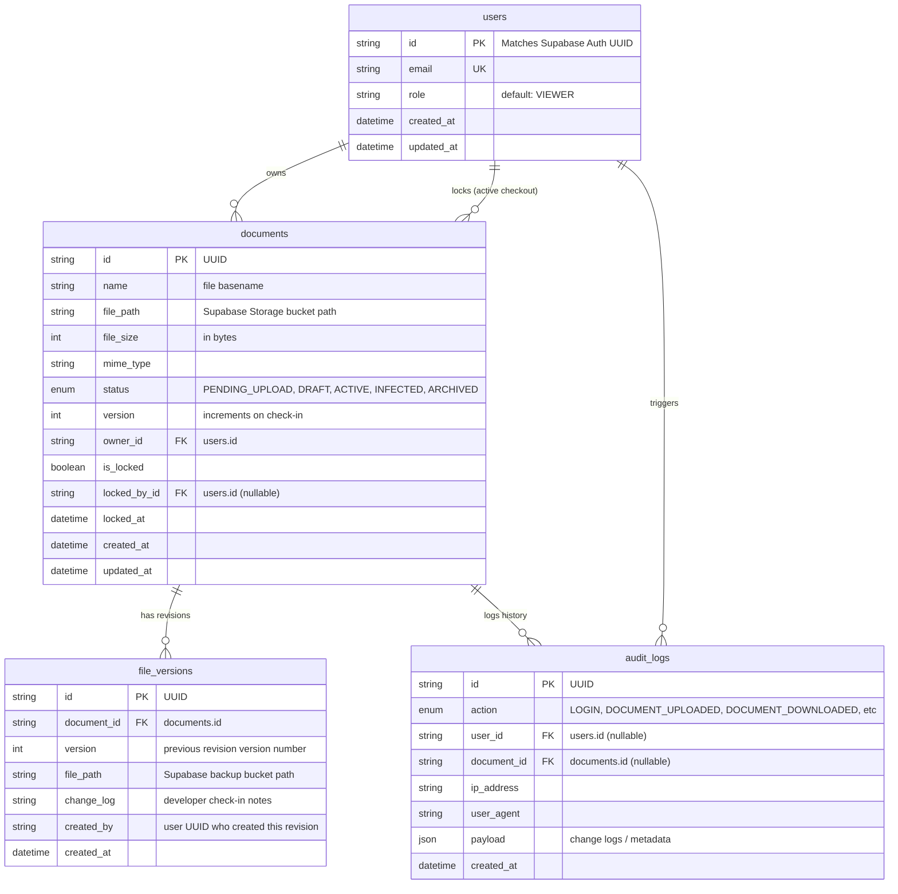

# Project Memory Bank: brain.md
## System Name: MITCON Credential Digital File Storage System (BCD-FSS)
**Document Version:** 1.4.0  
**Last Updated:** June 29, 2026  

This document serves as the persistent memory, architectural blueprint, and technical documentation bank for all engineers working on the **MITCON Credential Digital File Storage System (BCD-FSS)**.

---

## 1. High-Level Design (HLD) & Technology Stack

The project implements a **Stateless Three-Tier Architecture** optimized for high concurrency, real-time lock synchronization, and asynchronous job boundaries.

```
       [ Client Presentation Tier ] (React 19, Zustand, TanStack Query)
                   │
                   ▼ (HTTPS / WSS via Nginx Proxy)
        [ API Business Logic Tier ] (Express 5, Node.js ES2023 ESM)
         ├── Auth & Identity Sync (Supabase Auth API)
         └── Real-time WS Sync (Socket.IO with Redis Adapter)
                   │
                   ├── Asynchronous Enqueue
                   │   ▼
                   │ [ BullMQ Background Jobs ] (Malware Scan, PDF Gen)
                   │   │
                   ▼   ▼
        [ Relational Database & Cache Tier ]
         ├── Database: PostgreSQL (Prisma ORM Client Singleton)
         ├── Cache / Queue Broker: Redis Server Cluster
         └── Blob Object Store: Supabase Storage Buckets
```

### Technical Blueprint:
* **Frontend:** React 19, Vite, Tailwind CSS, Zustand, TanStack Query, ShadCN UI.
* **Backend:** Node.js (ES2023 JS ESM), Express 5.
* **Database & ORM:** PostgreSQL + Prisma ORM Client.
* **Authentication:** Supabase Auth Integration (signed JWTs, OIDC).
* **Binary Storage:** Supabase Storage (S3-compatible bucket keys).
* **Caching & Queue:** Redis Server + BullMQ.
* **WebSockets:** Socket.IO utilizing `@socket.io/redis-adapter` for auto-scale environments.
* **Security Middleware:** Helmet headers, CORS filters, express-rate-limit, jsonwebtoken, bcrypt.

---

## 2. Entity-Relationship (ER) Database Schema

The database relies on PostgreSQL mapped via the Prisma ORM Client. The models optimize relational indexes and cascade deletions.



---

## 3. Low-Level Design (LLD) & Modular Boundaries

The backend implements a **Feature-Based Modular Architecture** to keep boundary scopes strict and testable as the codebase scales.

### 3.1. Standard Module Structure
Every business feature (e.g. `src/modules/documents/`) must adhere to this folder structure:
* **`*.routes.js`:** Declares endpoints and wires middlewares (auth, validators) to controllers.
* **`*.controller.js`:** Transport boundary (HTTP req/res). Extracts variables, invokes DTOs, and calls Services.
* **`*.dto.js`:** Serializes incoming request parameters (Input DTO) and formats outgoing records (Output DTO).
* **`*.service.js`:** Agnostic business algorithm orchestrations. No Express variables.
* **`*.repository.js`:** Pure database query handlers using the Prisma Client singleton.
* **`*.validation.js`:** Zod verification schemas checking request shapes.

### 3.2. Middleware Execution Chain
```
[Client Call]
    │
    ├── 1. Security filters (Helmet, CORS)
    ├── 2. Rate Limiting check
    ├── 3. Correlation Token generation (requestIdMiddleware)
    ├── 4. Request Logging (pino-http)
    ├── 5. Supabase JWT Authentication checks (auth.mw.js)
    ├── 6. RBAC Role scopes & MFA checks (rbac.mw.js)
    ├── 7. Request shape validations (Zod validateRequest)
    │
    ▼
[Controller Handler] ─── (Invokes DTO & Service)
    │
    ├── Route processing throws Domain Exception...
    │
    ▼
[Error Logger (errorLogger.mw)] ─── Logs correlated error metrics via Request ID
    │
    ▼
[Global Express Error Formatter] ─── Returns standardized JSON error envelope
```

---

## 4. Architectural Decision Records (ADRs)

### ADR-001: Decoupling HTTP Transport and Server Bootstrap
* **Context:** Integration tests need to assert HTTP routes without blocking physical ports.
* **Decision:** We separate the Express pipeline configuration (`app.js`) from the network port listener (`server.js`).
* **Consequences:** Supertest runs mock HTTP assertions in-memory, avoiding port collision errors.

### ADR-002: Fail-Fast Zod Verification Configs
* **Context:** Undefined environment variables (e.g., missing API keys) can lead to silent errors during runtime.
* **Decision:** Create `config/env.js` which loads variables using `dotenv` and parses them using Zod validation.
* **Consequences:** If any key is missing or type-mismatched, the server logs validation errors and crashes immediately during boot.

### ADR-003: Singleton Pattern for Database and Cache Clients
* **Context:** Opening new connection channels for every query exhausts PostgreSQL and Redis connection pool limits.
* **Decision:** Export database, Redis, and Supabase client instances as singletons from the `config/` layer.
* **Consequences:** The application maintains a constant, optimized pool size across its lifecycle.

### ADR-004: Structured JSON Logging using Pino
* **Context:** Default `console.log()` outputs are slow and unparseable by log indexers.
* **Decision:** Use Pino and pino-http for logging. Toggle `pino-pretty` formatting in development and raw JSON in production.
* **Consequences:** Fast, non-blocking logs that are easily indexed by log aggregators (e.g. Datadog).

### ADR-005: Pure JavaScript (ES2023) ESM with JSDoc
* **Context:** The team decided to avoid compilation overheads and build using native JavaScript ESM.
* **Decision:** Write all files as standard `.js` ES Modules. Document arguments and return values using JSDoc.
* **Consequences:** Eliminates compilation steps (`tsc`), enables native Node.js hot-reloads (`node --watch`), and maintains IDE autocomplete.

### ADR-006: Local Redis Availability Tolerance during Development
* **Context:** Local developers may work on system modules (e.g. user authentication, database models) without having a running local Redis instance, causing bootstrap connection verification crashes.
* **Decision:** Wrap the Redis `.ping()` check in `server.js` bootstrap inside a try-catch construct, logging a warning rather than throwing a fatal crash.
* **Consequences:** Server boots up successfully on localhost without requiring local Redis to be constantly online.

### ADR-007: Development Environment Queue Mocking (REDIS_ENABLED toggle)
* **Context:** While ADR-006 allowed the server to boot up, the active instantiation of BullMQ Queues and Workers inside module files triggered background reconnect loops within `ioredis` that flooded the terminal with connection spams (`ECONNREFUSED`).
* **Decision:** Introduce a configuration toggle `REDIS_ENABLED` in environment schemas. When set to `false`, the backend instantiates lightweight mock classes (e.g., `MockQueue` and `MockWorker`) implementing standard Queue/Worker interfaces.
* **Consequences:** Developers can run, test, and write CRUD/auth layers locally without running local Redis. Job enqueues log output metrics to stdout instead of throwing socket errors.

---

## 5. Architectural Workflows

### 5.1. Authentication & Profile Sync Flow
Supabase Auth manages client credentials, generating a JWT.
1. Client submits JWT in the `Authorization: Bearer <JWT>` header.
2. Express backend decodes and verifies the token signature against the `SUPABASE_JWT_SECRET`.
3. If valid, the backend checks if the user's UUID exists in the local PostgreSQL `users` table.
4. If missing (first login), the backend synchronously duplicates the profile into the local database (setting the default role to `VIEWER`).
5. Evaluates Multi-Factor Authentication (MFA) status by inspecting the JWT `amr` claims array (checking for `mfa`).
6. Attaches the user object and MFA state to the request object (`req.user`).

### 5.2. Document Direct-to-Storage Upload Flow
Avoids routing large file uploads through the Express process:
1. Client calls `POST /api/v1/documents/upload-intent` specifying metadata.
2. Backend creates a database record with `status: PENDING_UPLOAD` and returns a Supabase Storage signed upload URL.
3. Client uploads the binary file directly to the S3 bucket using the signed URL.
4. Client calls `POST /api/v1/documents/:id/complete-upload` notifying the backend that the upload finished.
5. Backend updates the database status to `DRAFT` and enqueues a background BullMQ job for malware scanning.

### 5.3. Concurrency Checkout & Return Flow
Guarantees file locking and prevents edit conflicts:
1. User A requests checkout via `POST /api/v1/documents/:id/checkout`.
2. Backend starts a database transaction to verify lock status. If unlocked, sets `isLocked: true`, `lockedById: UserA`, and `lockedAt: new Date()`.
3. Broadcasts a `DOCUMENT_LOCKED` WebSocket event via Socket.IO to disable edit controls for other users.
4. When finished, User A uploads the modified file and calls `POST /api/v1/documents/:id/checkin`.
5. Backend verifies User A owns the active lock, commits a new `FileVersion` record, increments `version`, clears the lock fields, and broadcasts a `DOCUMENT_UNLOCKED` event.

---

## 6. Implementation Registry & Created Files

The following files have been created in the `backend/` project workspace:

### 6.1. Configuration Layer (`src/config/`)
* **[env.js](file:///c:/Users/Vibin.Cariappa/Desktop/Credentia/backend/src/config/env.js):** Environment variable verification and schema parsing. Stores the `REDIS_ENABLED` boolean toggle flag.
* **[database.js](file:///c:/Users/Vibin.Cariappa/Desktop/Credentia/backend/src/config/database.js):** Exports the Prisma database connection client singleton.
* **[supabase.js](file:///c:/Users/Vibin.Cariappa/Desktop/Credentia/backend/src/config/supabase.js):** Initializes and exports the Supabase client wrapper. Defines bucket storage identifiers.
* **[redis.js](file:///c:/Users/Vibin.Cariappa/Desktop/Credentia/backend/src/config/redis.js):** Sets up and exports the **ioredis** Client connection singleton. Yields a lightweight mock client if `REDIS_ENABLED` is false.
* **[bullmq.js](file:///c:/Users/Vibin.Cariappa/Desktop/Credentia/backend/src/config/bullmq.js):** Defines BullMQ connection credentials, default retries, exponential backoffs, and queue limits.
* **[logger.js](file:///c:/Users/Vibin.Cariappa/Desktop/Credentia/backend/src/config/logger.js):** Centralized Pino client configurations.
* **[security.js](file:///c:/Users/Vibin.Cariappa/Desktop/Credentia/backend/src/config/security.js):** Stores CORS origins, Helmet CSP policies, and encryption parameters.
* **[index.js](file:///c:/Users/Vibin.Cariappa/Desktop/Credentia/backend/src/config/index.js):** Central portal re-exporting all configuration singletons.

### 6.2. Logging & Middlewares (`src/shared/`, `src/middleware/`)
* **[request-id.js](file:///c:/Users/Vibin.Cariappa/Desktop/Credentia/backend/src/shared/request-id.js):** Correlation request identifier generator middleware.
* **[requestLogger.js](file:///c:/Users/Vibin.Cariappa/Desktop/Credentia/backend/src/middleware/requestLogger.js):** HTTP request and response performance log logger.
* **[errorLogger.js](file:///c:/Users/Vibin.Cariappa/Desktop/Credentia/backend/src/middleware/errorLogger.js):** Global exception stack trace logging filter.

### 6.3. Application Bootstrap
* **[app.js](file:///c:/Users/Vibin.Cariappa/Desktop/Credentia/backend/src/app.js):** Express application configuration, payload limit parsers, route mounts, and global error formatters.
* **[server.js](file:///c:/Users/Vibin.Cariappa/Desktop/Credentia/backend/src/server.js):** The HTTP server network bootstrapper. Instantiates graceful shutdowns for BullMQ workers and Redis connections on process signals (`SIGINT`, `SIGTERM`).

### 6.4. Database ORM Foundation (`prisma/`)
* **[schema.prisma](file:///c:/Users/Vibin.Cariappa/Desktop/Credentia/backend/prisma/schema.prisma):** Foundational configuration defining standard PostgreSQL datasource and generator.
* **[seed.js](file:///c:/Users/Vibin.Cariappa/Desktop/Credentia/backend/prisma/seed.js):** Data populator runner template placeholder.

### 6.5. Infrastructure Services (`src/services/`)
* **[storage.service.js](file:///c:/Users/Vibin.Cariappa/Desktop/Credentia/backend/src/services/storage/storage.service.js):** Wraps storage operations (signed URLs, moves, deletes) executing against Supabase buckets.

### 6.6. Background Processing & Workers Layer (`src/jobs/`)
* **[audit.queue.js](file:///c:/Users/Vibin.Cariappa/Desktop/Credentia/backend/src/jobs/queues/audit.queue.js):** Asynchronous transaction logging publisher client. Runs on mock objects if `REDIS_ENABLED` is false.
* **[notification.queue.js](file:///c:/Users/Vibin.Cariappa/Desktop/Credentia/backend/src/jobs/queues/notification.queue.js):** Alert and mailer job publisher client.
* **[preview.queue.js](file:///c:/Users/Vibin.Cariappa/Desktop/Credentia/backend/src/jobs/queues/preview.queue.js):** Low-res preview generation job publisher client.
* **[report.queue.js](file:///c:/Users/Vibin.Cariappa/Desktop/Credentia/backend/src/jobs/queues/report.queue.js):** Large spreadsheet compilation job publisher client.
* **[scheduler.queue.js](file:///c:/Users/Vibin.Cariappa/Desktop/Credentia/backend/src/jobs/queues/scheduler.queue.js):** Sweeper and lock cleanup cron publisher client.
* **[virus.queue.js](file:///c:/Users/Vibin.Cariappa/Desktop/Credentia/backend/src/jobs/queues/virus.queue.js):** Upload drafting scan job publisher client.
* **[audit.worker.js](file:///c:/Users/Vibin.Cariappa/Desktop/Credentia/backend/src/jobs/workers/audit.worker.js):** Consumer thread executing audit logs database writes.
* **[notification.worker.js](file:///c:/Users/Vibin.Cariappa/Desktop/Credentia/backend/src/jobs/workers/notification.worker.js):** Consumer thread dispatching mailers and WebSockets alerts.
* **[preview.worker.js](file:///c:/Users/Vibin.Cariappa/Desktop/Credentia/backend/src/jobs/workers/preview.worker.js):** Consumer thread running rendering thumbnails.
* **[report.worker.js](file:///c:/Users/Vibin.Cariappa/Desktop/Credentia/backend/src/jobs/workers/report.worker.js):** Consumer thread rendering CSV metrics sheets.
* **[scheduler.worker.js](file:///c:/Users/Vibin.Cariappa/Desktop/Credentia/backend/src/jobs/workers/scheduler.worker.js):** Consumer thread sweeping expired database check-out locks.
* **[virus.worker.js](file:///c:/Users/Vibin.Cariappa/Desktop/Credentia/backend/src/jobs/workers/virus.worker.js):** Consumer thread executing upload file antivirus evaluations.
* **[index.js](file:///c:/Users/Vibin.Cariappa/Desktop/Credentia/backend/src/jobs/index.js):** Consolidated queues and workers registry, managing unified cluster shutdowns.

---

## 7. Core Database Architecture Concepts

### 7.1. How Prisma Generates SQL
Prisma does not execute query parsing dynamically on the Node.js event loop thread. Instead, queries (e.g. `prisma.user.findMany()`) are compiled into an Abstract Syntax Tree (AST) inside Node.js. This AST is sent directly to Prisma's internal query engine compiled in **Rust**. The engine maps the AST against the schema mapping targets and translates it into highly optimized, parameterized native SQL queries, executing them against PostgreSQL and returning hydrated JSON back.

### 7.2. Why Prisma Client Should Be a Singleton
Prisma Client instantiates database connection pools internally. If you call `new PrismaClient()` across multiple files or routes, you create separate pools. Under load, these redundant pools quickly exceed PostgreSQL's `max_connections` limit, causing connections to drop. Utilizing a singleton exports a single connection instance reused globally.

### 7.3. How Migrations Work
* **migrate dev:** Compares the structural state of `schema.prisma` against your local PostgreSQL instance, generates a timestamped `.sql` migration file tracking DDL modifications, updates the local tables, and logs execution in `_prisma_migrations`.
* **migrate deploy:** Used in production pipelines. It skips comparison checks and runs pending, pre-generated SQL migration scripts sequentially to prevent production state drifts.

### 7.4. When to Use Transactions
Transactions are required to enforce database **atomicity (ACID)**—guaranteeing that either *all* SQL writes in a sequence execute successfully, or *none* of them do:
* **Race Conditions:** When checking out files, we execute a read check (`isLocked === false`) followed by a write update (`isLocked = true`). This must run in a database transaction block to prevent concurrent clients from claiming the same lock.
* **Atomic Writes:** Modifying metadata alongside tracking audit history logs. If database connections drop midway, the transaction rolls back changes to prevent incomplete telemetry logs.

### 7.5. Metadata vs Blob Binaries Allocation
Relational databases are optimized for low-latency queries, indexing, and joining structured tables. Storing large binary payloads (blobs, PDFs, images) inside SQL tables creates massive storage sizes, degrades buffer pool cache performance, and slows down database backups. Storing raw metadata logs (file sizes, keys, locking parameters) in PostgreSQL keeps database lookups fast, while Supabase Storage handles low-cost binary storage and CDN caching.

---

## 8. Supabase Infrastructure Layer Concepts

### 8.1. Decoupling Supabase from Application Business Logic
Supabase provides core cloud infrastructure services (authentication interfaces, raw S3 bucket API proxies). Our backend encapsulates these services within standard application wrapper layers (e.g., `StorageService`). This decouples Supabase's specific SDK formats from our business logic services. If we migrate to an alternative S3 provider (like AWS S3 or MinIO) in the future, we only swap the implementation inside `StorageService` without rewriting core business workflows.

### 8.2. Service Role Key vs Anon Key
* **Anon Key:** A public API key safe to distribute to client browsers. Requests made with this key are strictly checked against database **Row Level Security (RLS)** policies and storage bucket access rules.
* **Service Role Key:** An administrative bypass key that overrides all security checks and RLS parameters. It grants complete read/write/delete permissions across all databases and buckets.

### 8.3. Why the Backend Owns the Service Role Key
The `Service Role Key` possesses absolute privileges. If exposed to client applications, attackers could read, modify, or delete any record or file. The backend serves as the secure vault that stores this key, wrapping operations (such as validating file checks and deleting database assets) behind restricted API routes.

### 8.4. Direct-to-Storage Uploads via Signed URLs
Routing large binary uploads (e.g., 50MB PDF document packets) through the Express application has significant performance costs:
* **Memory and CPU Overhead:** Node.js must buffer or stream chunk buffers, causing high memory spikes and event loop blocking on the main thread.
* **Bandwidth Bottlenecks:** The server pays double the bandwidth costs (receiving the file from the client, then uploading it to S3).

Instead, the client calls the backend to request a `signed upload URL`. This URL contains a short-lived cryptographic signature allowing the browser to PUT the binary file directly to Supabase S3 storage. Once finished, the browser registers the file path with the backend. This keeps the backend fast and responsive.

### 8.5. Enterprise Document Bucket Organization
For enterprise scalability, files are segregated into distinct buckets based on their access permissions, lifecycle logs, and performance needs:
1. **`mc-documents` (Private, Strict Access):** Houses master document PDFs and original credentials. Runs under strict RLS rules, requiring backend signed URLs to download.
2. **`mc-previews` (Optimized, Public Cache):** Contains low-resolution image thumbnails and previews generated by background workers. Configured with public read access and long CDN caching rules to speed up dashboard loads.
3. **`mc-audits-archive` (Worm/Cold Storage):** Retains zipped annual audit trails and access sheets. Configured with cold-storage pricing tiers and strict retention rules to prevent deletion.

---

## 9. Background Job Broker Layer (Redis & BullMQ)

### 9.1. Decoupled Processing Architecture
Time-consuming operations (calculating antivirus hashes, rendering thumb slides, archiving tables) must never run on the Node.js primary thread. Doing so blocks the single event loop, causing requests to time out. Utilizing BullMQ backed by Redis creates an asynchronous broker where background jobs are enqueued as metadata payloads. Decoupled worker containers poll these queues and process jobs independently, maintaining HTTP server availability.

### 9.2. Connection Lifecycle & Graceful Shutdown Strategy
Workers maintain continuous Socket connections to Redis using `BRPOPLPUSH` blockers. If the application server restarts or scales down without terminating these connections:
* Active executing jobs are cut off mid-run, resulting in corrupted files or missing database indexes.
* Redis sockets remain registered, exhausting file descriptor limits.

To mitigate this, `handleGracefulShutdown` intercepts OS signals (`SIGTERM`, `SIGINT`), closes the HTTP server, and invokes `shutdownQueuesAndWorkers()`. This stops workers from pulling new jobs while allowing active jobs to finish within a 10-second safety window, ensuring no jobs are lost or corrupted.
